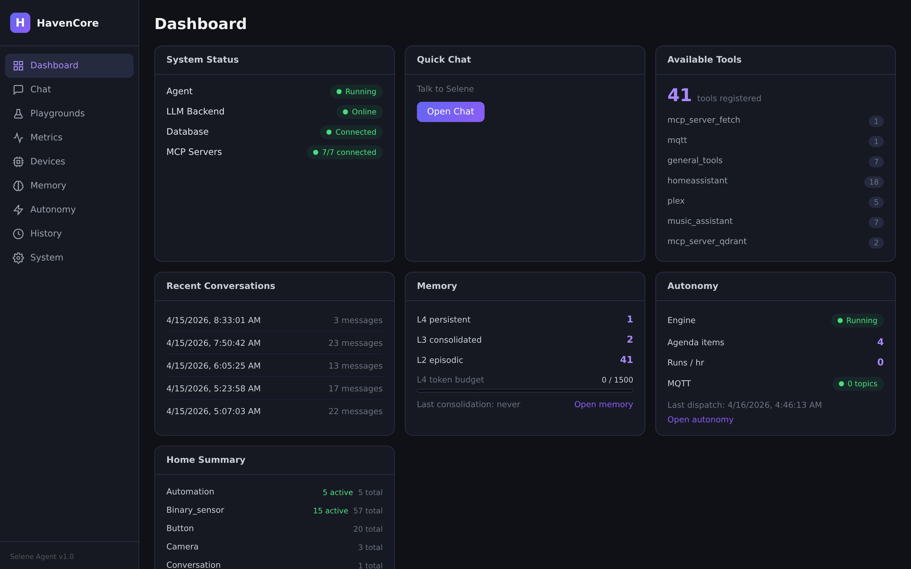
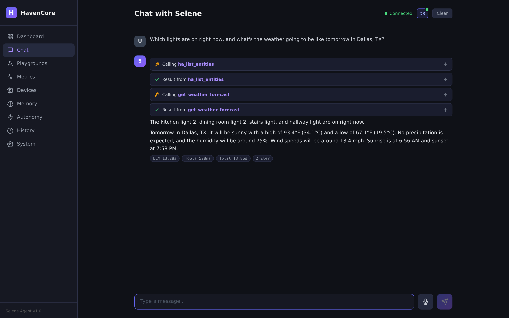
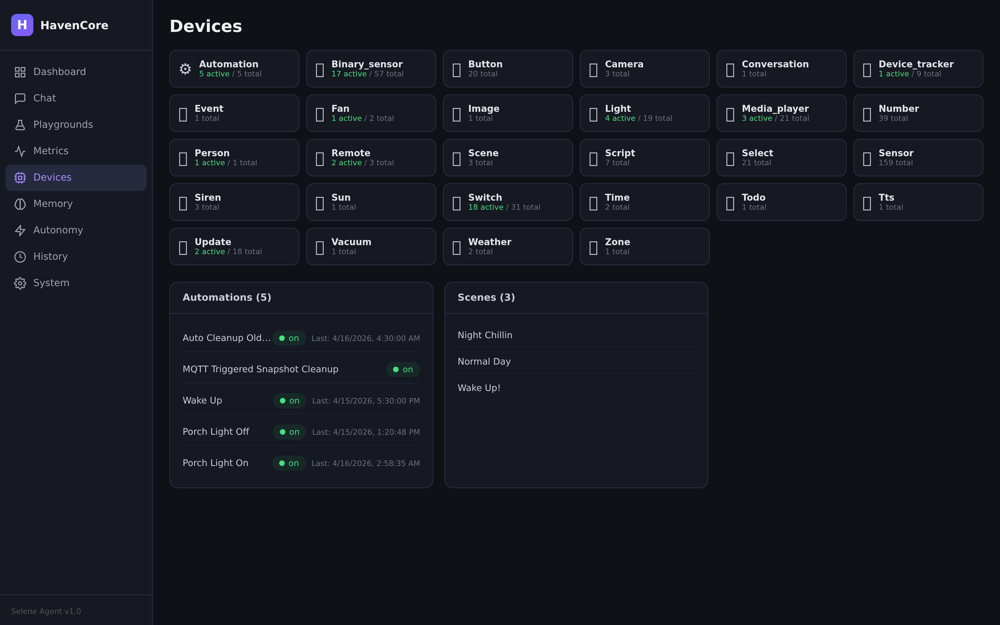
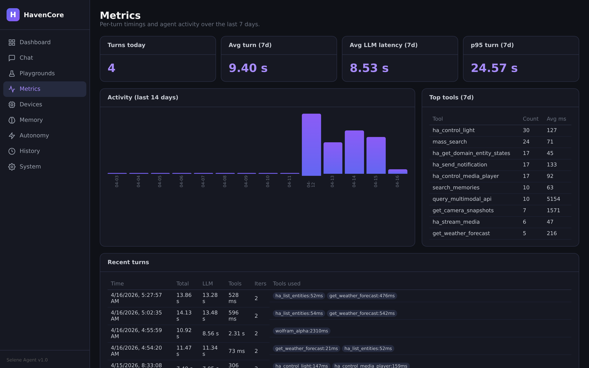
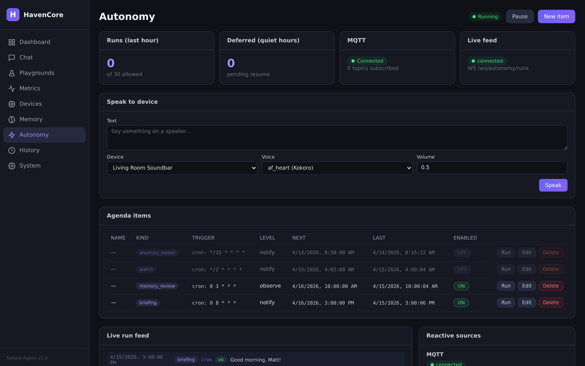
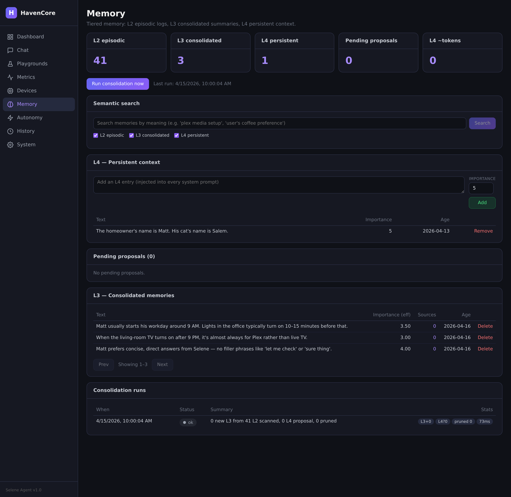
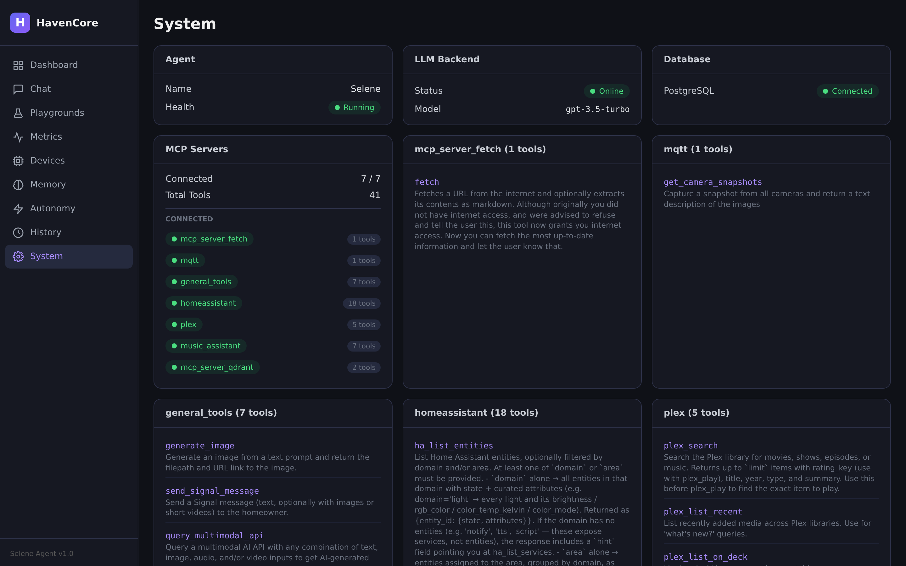
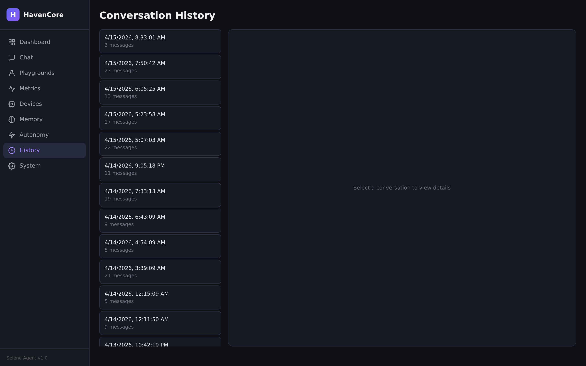
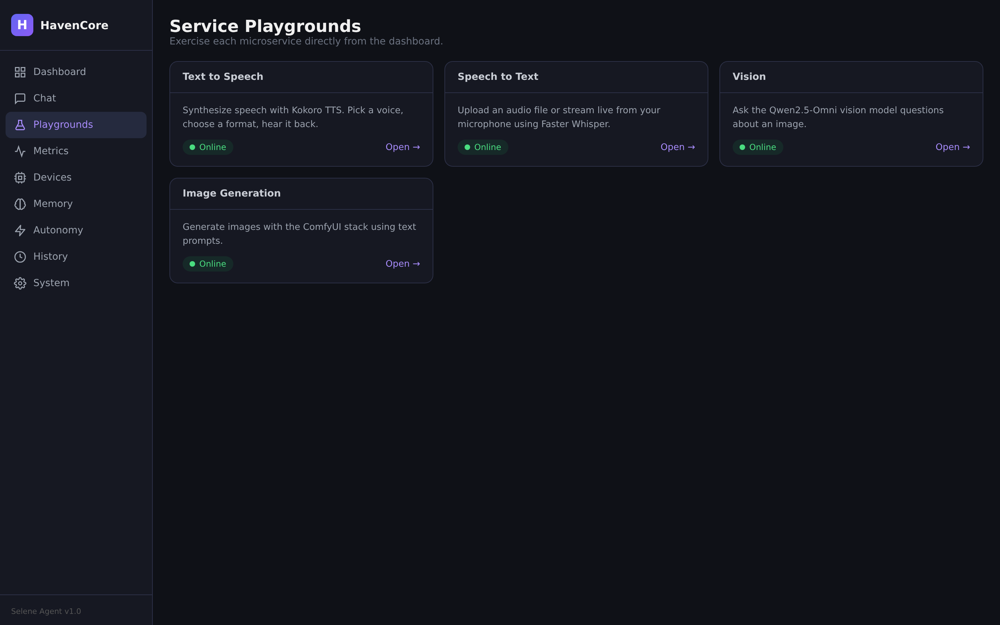

<div align="center">

# HavenCore

### A self-hosted, GPU-accelerated AI that actually lives in your house.

Voice in, voice out. Your own LLM. Your own tools. Your data never leaves the box.

[](./LICENSE)
[](./compose.yaml)
[](https://developer.nvidia.com/cuda-downloads)
[](./services/agent/pyproject.toml)
[](./services/agent/frontend)
[](./services/agent)



</div>

---

## What this is

**HavenCore** is a production-grade personal AI assistant I built to run entirely on my own hardware — no cloud inference, no data phoned home. It hears you through a wake-word device, transcribes with Whisper, reasons with a local 72B LLM (vLLM), calls tools over MCP (Home Assistant, Plex, web search, image gen, etc.), speaks back with Kokoro TTS, and runs proactively on its own schedule when you're not looking.

Everything is one `docker compose up -d` away. Twelve containers, one GPU fleet, one dashboard.

> The assistant's name is **Selene**. She lives on four RTX 3090s in my basement.

> **Hardware you'll need:** Linux host, recent NVIDIA driver + container toolkit, Docker Compose v2, and GPU VRAM for your chosen LLM. The default Qwen2.5-72B-AWQ stack wants **≥ 48 GB VRAM split across two cards**; a single 24 GB card works if you swap in a smaller model. Plan on ~60 GB of disk for images + model weights on first build.

---

## Demo

<table>
<tr>
<td width="50%">

**Chat with tool visibility**
Every tool call is rendered inline — arguments, results, and per-turn timings (LLM / tools / total / iterations) so you can actually *see* the agent think.

</td>
<td width="50%">



</td>
</tr>
<tr>
<td width="50%">



</td>
<td width="50%">

**Live Home Assistant state**
Real entity counts, automations, scenes — pulled straight from HA and grouped by domain. Selene controls all of it via MCP tool calls.

</td>
</tr>
<tr>
<td width="50%">

**Per-turn metrics, persisted**
Every LLM call, every tool invocation, every latency. Stored in Postgres. Charted over 14 days. p95 turn time, top tools, avg LLM latency — all queryable.

</td>
<td width="50%">



</td>
</tr>
<tr>
<td width="50%">



</td>
<td width="50%">

**Autonomous agenda**
Selene isn't purely reactive. A background engine fires scheduled briefings, anomaly sweeps over HA state, user-programmed reminders/watches/routines, and a nightly memory-consolidation pass. With a kill switch, rate limits, tier-gated tools, and quiet hours.

</td>
</tr>
<tr>
<td width="50%">

**Tiered semantic memory (L2 → L3 → L4)**
Qdrant-backed episodic store that a nightly LLM pass consolidates into summaries, promotes the important stuff into persistent context, and bounds the whole thing to a fixed token budget injected into every prompt.

</td>
<td width="50%">



</td>
</tr>
<tr>
<td width="50%">



</td>
<td width="50%">

**System health & MCP fleet**
Every MCP tool server, every registered tool, live log stream, vLLM model info, DB status. The boring operator plane — but it's there.

</td>
</tr>
</table>

<details>
<summary><b>More screenshots</b> — conversation history, service playgrounds</summary>

| Conversation history | Service playgrounds |
|---|---|
|  |  |

Built-in playgrounds for TTS, STT, the vision model, and ComfyUI image generation — each proxied through the agent so there's zero CORS / network setup to test a model.

</details>

---

## Engineering highlights

This is the part that's worth scrolling for.

### Single-process, event-driven agent orchestrator
The core loop ([`orchestrator.py`](services/agent/selene_agent/orchestrator.py)) is a typed async generator that emits `THINKING` / `TOOL_CALL` / `TOOL_RESULT` / `METRIC` / `DONE` / `ERROR` events. The WebSocket handler streams them straight to the dashboard; the OpenAI-compatible endpoint assembles them into SSE. **Same code path, three surfaces.**

### Per-session orchestrator pool with cold-resume
Concurrent users don't share state. A [`SessionOrchestratorPool`](services/agent/selene_agent/utils/session_pool.py) keyed by `session_id` gives each conversation its own orchestrator, its own messages, its own `asyncio.Lock` — so two dashboard tabs or a dashboard plus a voice puck never race on each other's turns. The pool runs a 30-second idle sweep (flush timed-out sessions to Postgres, reinitialize in place), an LRU cap at 64 (evict + persist), and a shutdown flush (nothing lost on restart). A stored `session_id` can be cold-resumed from the DB via `POST /api/conversations/{id}/resume` — the `/history` page's **Resume** button hydrates a past conversation straight into `/chat` and keeps going. `/v1/chat/completions` deliberately bypasses all of this: it's stateless by design, ephemeral orchestrator per request, caller owns the history.

### MCP all the way down
Tools aren't a hardcoded registry — they're discovered at startup by a [`MCPClientManager`](services/agent/selene_agent/utils/mcp_client_manager.py) that spawns each tool server as a subprocess and speaks stdio JSON-RPC to it. A `UnifiedTool` abstraction converts MCP tool schemas to OpenAI function-calling format on the fly. Adding a tool server is a new folder with a `__main__.py`.

**7 MCP servers, 41 tools** live today: Home Assistant (18), Plex (5), Music Assistant (7), Qdrant memory (2), web/Wolfram/Wikipedia/Brave/weather/image-gen/Signal (7), MQTT cameras (1), HTTP fetch (1).

### Autonomy engine with actual guardrails
Selene runs an asyncio dispatcher in the same process that fires `briefing`, `anomaly_sweep`, user-defined `reminder` / `watch` / `routine` / `memory_review` kinds. Each run:
- spins up a **fresh** orchestrator with its own `session_id` — never touches user chat state
- is tool-gated by tier (`observe` / `notify` / `speak` / `act`) with a hard deny-list on top
- honors a global hourly rate limit, per-signature cooldowns, and quiet hours
- emits a full audit trail (messages, tool calls, metrics) into `autonomy_runs`
- can be killed at runtime via `POST /api/autonomy/pause`

First novel `act`-tier action for any signature requires explicit confirmation — *then* joins a per-item allow-list.

### Tiered memory with nightly consolidation
Not RAG-over-everything. A four-tier scheme:
- **L1** — current conversation (session scope)
- **L2** — episodic, per-turn, Qdrant embeddings
- **L3** — consolidated summaries produced by a nightly LLM pass, with importance decay and rank boosts
- **L4** — persistent facts promoted through a gated review process, injected into every system prompt within a bounded token budget

Search at query time blends tiers; the `/memory` page lets you inspect and edit each level.

### Per-turn metrics you can actually query
Every agent turn writes a row to a `turn_metrics` Postgres table: LLM latency, per-tool latencies, total, iteration count, tool list. The dashboard renders p95s, top tools, 14-day activity — out of the same pool the orchestrator uses, no separate metrics service.

### Single-port FastAPI serving SPA + REST + WebSocket + OpenAI-compat
Port 6002 serves:
- the static SvelteKit dashboard build (mounted from `/srv/agent-static` — outside `/app` so the dev volume mount doesn't shadow it)
- `/api/*` REST, `/ws/*` WebSocket, `/v1/*` OpenAI-compatible chat completions (streaming SSE supported)
- service proxies (`/api/{tts,stt,vision,comfy}/*`) so the playground UIs work same-origin with zero CORS config

One uvicorn, one network surface. Nginx in front just does TLS termination and path routing.

### The voice edge is a separate repo
Wake-word + mic + speaker runs on a Raspberry Pi or an ESP32-Box-3 and talks to HavenCore over the OpenAI-compat API. See [ThatMattCat/havencore-edge](https://github.com/ThatMattCat/havencore-edge).

---

## Stack

<table>
<tr>
<td>

**AI / ML**
- vLLM (Qwen2.5-72B-AWQ, 2× tensor-parallel)
- Faster-Whisper (STT)
- Kokoro TTS
- Qwen2.5-Omni (vision)
- ComfyUI (image gen)
- BGE-large embeddings (TEI)
- Qdrant (vectors)

</td>
<td>

**Backend**
- Python 3.11, FastAPI, uvicorn
- Model Context Protocol (MCP)
- OpenAI SDK (as vLLM client)
- PostgreSQL (conversations + metrics)
- Mosquitto (MQTT)
- Nginx (gateway)

</td>
<td>

**Frontend**
- SvelteKit 2 / Svelte 5 runes
- TypeScript
- Static adapter, SPA fallback
- WebSocket client with reconnection
- Live log stream

</td>
<td>

**Infra**
- Docker Compose, 12 services
- NVIDIA Container Toolkit
- 4× RTX 3090 dev box
- Optional Grafana Loki push
- Health-checked services
- Volume-mounted dev workflow

</td>
</tr>
</table>

---

## Architecture at a glance

```
┌──────────────────────────────────────────────────────────────────┐
│  Edge device (Pi / ESP32)  →  wake-word, mic, speaker            │
│                    │                                             │
│                    ▼   OpenAI-compatible HTTPS                   │
│  ┌──────────────── nginx (80) ──────────────────┐                │
│  │                                              │                │
│  │   agent (6002) ─┬─ orchestrator (events) ───────► vLLM (8000) │
│  │    FastAPI +    │                                             │
│  │    SvelteKit    ├─ MCP client manager ─► general_tools        │
│  │                 │                       homeassistant         │
│  │                 │                       plex / music_assistant│
│  │                 │                       qdrant_tools          │
│  │                 │                       mqtt_tools            │
│  │                 │                                             │
│  │                 ├─ conversation_db ───► postgres              │
│  │                 ├─ metrics_db (turn_metrics)                  │
│  │                 └─ autonomy engine (asyncio)                  │
│  │                                                               │
│  │   stt (6001)  tts (6005)  vision (8100)  comfy (8188)         │
│  │   embeddings (3000)  qdrant (6333)  mosquitto (1883)          │
│  └───────────────────────────────────────────────────────────────┘
```

Full diagrams and per-service docs: [docs/architecture.md](docs/architecture.md).

---

## Running it

Everything below assumes a Linux box with NVIDIA GPUs, the container toolkit, and Docker Compose v2.

```bash
git clone https://github.com/ThatMattCat/havencore.git
cd havencore
cp .env.tmpl .env        # fill in HOST_IP_ADDRESS, HAOS_TOKEN, API keys
docker compose up -d     # first build: 60–90 min
                         # first model load: 10–15 min (Qwen2.5-72B-AWQ, ~35 GB pull)
open http://localhost    # SvelteKit dashboard
```

Full walkthrough, hardware requirements (TL;DR: one 24 GB GPU works with a smaller model; the default 72B AWQ wants ≥48 GB split across two), NVIDIA driver pinning, and troubleshooting: [**docs/getting-started.md**](docs/getting-started.md).

### Things worth knowing
- **Hot reload for Python:** services mount their source; `docker compose restart agent` picks up edits.
- **Hot reload for the dashboard:** `cd services/agent/frontend && npm run dev` — proxies to `:6002`.
- **Test an MCP server in isolation:** `docker compose exec -T agent python -m selene_agent.modules.mcp_general_tools` and speak JSON-RPC stdio — full guide in [docs/services/agent/tools/development.md](docs/services/agent/tools/development.md).

---

## Repo layout

```
havencore/
├── compose.yaml              # 12 services
├── .env.tmpl                 # every config knob documented inline
├── services/
│   ├── agent/                # FastAPI + SvelteKit + MCP servers
│   │   ├── selene_agent/     #   Python package: orchestrator, autonomy, api routers
│   │   │   ├── modules/      #     MCP tool servers (general, homeassistant, qdrant, mqtt, plex, mass)
│   │   │   └── autonomy/     #     background engine (schedule, turn, tool gating, notifiers)
│   │   └── frontend/         #   SvelteKit dashboard (static adapter)
│   ├── speech-to-text/       # Faster-Whisper
│   ├── text-to-speech/       # Kokoro
│   ├── iav-to-text/          # Vision LLM (image/audio/video → text)
│   ├── text-to-image/        # ComfyUI
│   ├── vllm/  llamacpp/      # LLM backends (vLLM default)
│   ├── postgres/ qdrant/ embeddings/
│   ├── nginx/ mosquitto/
├── shared/                   # shared_config.py, logger, trace_id
└── docs/                     # deep-dive docs, per-service READMEs, integration guides
```

---

## Documentation

| | |
|---|---|
| [Architecture](docs/architecture.md) | System diagrams, data flow, scaling notes |
| [Getting started](docs/getting-started.md) | Install, GPU setup, first-run walkthrough |
| [Configuration](docs/configuration.md) | Every env var |
| [API reference](docs/api-reference.md) | REST, WebSocket, OpenAI-compat |
| [Agent internals](docs/services/agent/README.md) | Orchestrator, MCP manager, DB layer |
| [Autonomy engine](docs/services/agent/autonomy/README.md) | v1–v4 design + guardrails |
| [Memory tiers](docs/services/agent/autonomy/memory/README.md) | L2/L3/L4 consolidation |
| [Tool development](docs/services/agent/tools/development.md) | Adding an MCP server |
| [Home Assistant integration](docs/integrations/home-assistant.md) | HA setup + tool reference |
| [Media control](docs/integrations/media-control.md) | Plex / Music Assistant / TV wake |
| [Troubleshooting](docs/troubleshooting.md) | Common failures + fixes |

---

## Status & goals

This is a real thing I use every day — not a weekend demo. It's also unapologetically bespoke: it runs on *my* hardware, against *my* Home Assistant, with *my* Signal account as the notification channel. The repo is public and the code is readable, but config portability is an ongoing effort and there are rough edges you'd hit trying to run it cold.

**What I'd point employers at:**
- [`services/agent/selene_agent/orchestrator.py`](services/agent/selene_agent/orchestrator.py) — event-driven agent loop with per-turn metrics, safety limits, and session timeout handling.
- [`services/agent/selene_agent/autonomy/`](services/agent/selene_agent/autonomy/) — autonomy engine: tier-gated tools, per-signature cooldowns, fresh-session invariant, full audit trail.
- [`services/agent/selene_agent/utils/mcp_client_manager.py`](services/agent/selene_agent/utils/mcp_client_manager.py) — subprocess lifecycle + schema translation for MCP tool servers.
- [`services/agent/frontend/`](services/agent/frontend/) — SvelteKit dashboard, WebSocket chat store, streaming tool-call cards.
- [`compose.yaml`](compose.yaml) — twelve-service topology, GPU device assignments, health checks.

## Companion projects

- [**havencore-edge**](https://github.com/ThatMattCat/havencore-edge) — the wake-word + mic + speaker client.

## License

[LGPL v2.1](./LICENSE). Do what you want, share improvements back.

## Acknowledgments

Standing on the shoulders of [vLLM](https://github.com/vllm-project/vllm), [Kokoro](https://github.com/hexgrad/kokoro), [Faster-Whisper](https://github.com/SYSTRAN/faster-whisper), [Home Assistant](https://www.home-assistant.io/), [Qdrant](https://qdrant.tech/), [ComfyUI](https://github.com/comfyanonymous/ComfyUI), [MCP](https://modelcontextprotocol.io/), and the Svelte team.

<div align="center">

**Built by [Matt](https://github.com/ThatMattCat).**
If you're hiring and this looks like work you'd want someone to do for you, [let's talk](https://github.com/ThatMattCat).

</div>
